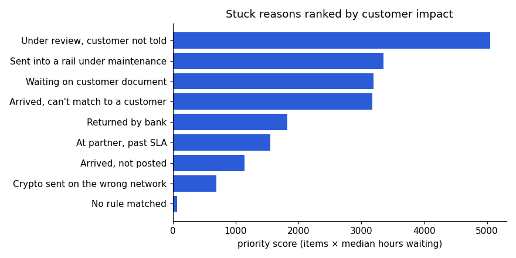

# Where's My Money: Stuck-Funds Triage

[](https://github.com/harshagarwal2412-cell/wheres-my-money-stuck-funds-triage/actions/workflows/ci.yml)

**Live demo:** https://harshagarwal2412-cell.github.io/wheres-my-money-stuck-funds-triage/

## Problem

In a cross-border money app, the 1-star reviews tell one story: money is stuck, and nobody tells the customer why. Each transfer's real status is split across three systems: the payment partner, the internal ledger, and compliance. The customer only sees "pending," and support has to check all three tools by hand to work out what happened.

## Solution

A triage console that joins those three sources for every open transfer and then:

1. **Classifies** each item into exactly one stuck reason with a deterministic, ordered rules engine.
2. **Routes** it to the team that owns the next step (Engineering, Compliance, Ops or the Customer).
3. **Explains** it with a merged event log for support and a plain-language message (English/Spanish) for the customer.
4. **Ranks** the reasons by customers affected × wait time, so the systemic fixes get prioritized.

The most important rule catches money that **arrived but was never posted**: the partner says it settled, but there's no ledger credit. Nothing technically failed, so no alert fires. The only way to find it is to reconcile the partner data against the ledger.

## Architecture

```
src/
├── domain/                  # Pure TypeScript, no React: fully unit-tested
│   ├── types.ts             # Transfer, Cause, Rail, TriagedTransfer models
│   ├── config.ts            # Rails + SLAs, cause catalogue, rule precedence
│   ├── classify.ts          # Ordered rules engine (first match wins)
│   ├── synthetic.ts         # Seeded PRNG (mulberry32) data generator
│   ├── analytics.ts         # KPIs, filtering, cause ranking, event-log join
│   ├── messages.ts          # Templated customer copy (EN/ES)
│   ├── cases.ts             # Edge cases + invariants shared by tests and UI
│   └── classify.test.ts     # Vitest suite
├── components/              # React views, one per tab
└── App.tsx                  # State: active tab, queue filters, selection, language
scripts/export-data.ts       # Exports the model to CSV for the analysis layer
analysis/                    # Python + SQL analysis (see below)
```

**Design decisions**

- **Rules engine over ML.** Every classification has to be explainable to support and auditable by compliance. The rules run in a fixed precedence, because an item can match several reasons at once (for example, under review *and* past SLA).
- **Facts from rules, words from templates.** Customer messages are fixed templates filled from classifier output. A language model could adjust tone, but it never decides what's true about someone's money.
- **Deterministic synthetic data.** A seeded generator produces the same 362-item snapshot on every load, so the tests, screenshots and demo always match.
- **One set of test cases, two runners.** The same edge cases run in CI through Vitest and live in the app's "How it's checked" tab.

## Testing

**TypeScript (Vitest):** 28 tests cover:

- rule precedence at every overlap (returned beats review, review beats settlement, and so on)
- SLA boundaries (exactly 72h is on track; 72h + 1 min is late)
- data invariants across the full snapshot
- analytics ordering and filtering
- message coverage in both languages

```bash
npm install
npm test          # Vitest
npm run typecheck # tsc, strict mode
npm run dev       # local dev server

pip install -r analysis/requirements.txt
pytest analysis   # Python/SQL tests
```

**Python (pytest):** 10 tests check the SQL layer against pandas and the rules engine.

CI runs both suites on every push: TypeScript type-check + tests + build, then Python queries + tests. A second workflow deploys `main` to GitHub Pages.

## Data analysis (Python + SQL)

[`analysis/`](analysis/) answers the business questions with **SQL on SQLite** and **pandas**. The data is normalized into the systems where a transfer's status actually lives: partner, ledger and compliance. See [`analysis/report.ipynb`](analysis/report.ipynb) for the full analysis with charts.

- 7 SQL queries using CTEs, window functions, a median built from `ROW_NUMBER()`, and a 4-way join + anti-join reconciliation
- A reconciliation query that finds "arrived, not posted" deposits from raw source tables alone. pytest asserts it matches the TypeScript rules engine exactly.
- pytest cross-checks every SQL aggregate against pandas



## Tech stack

**Languages:** TypeScript · Python · SQL

React 18 · Vite · Vitest · pandas · matplotlib · SQLite · pytest · Jupyter · GitHub Actions · GitHub Pages

## Data and assumptions

All transaction data is synthetic and generated in the browser. Complaint themes come from public app-store and Trustpilot reviews. Rail SLAs and internal system behavior are assumptions, and they're listed in the app. Not affiliated with or endorsed by UGLYCASH.

---

Harsh Agarwal
